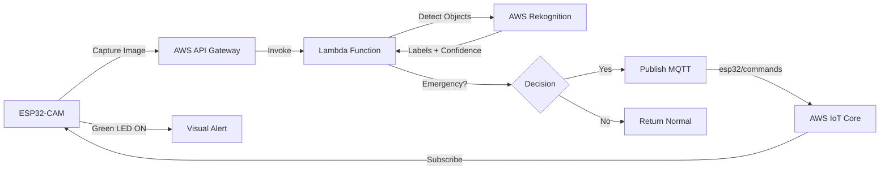

# Smart AI Traffic Management System

[](https://opensource.org/licenses/MIT)
[](https://www.espressif.com/)
[](https://aws.amazon.com/)

> An intelligent cloud-based emergency vehicle detection system using ESP32-CAM, AWS Rekognition, and IoT integration.

## 🚨 Overview

This project implements a smart traffic management system that automatically detects emergency vehicles (ambulances, fire trucks, police cars) using computer vision and triggers visual alerts. The system uses:

- **ESP32-CAM** for image capture
- **AWS Rekognition** for AI-powered vehicle detection
- **AWS Lambda** for serverless processing
- **AWS IoT Core** for real-time communication
- **LED indicators** for visual feedback

## 📸 Demo

### System in Action

<!-- Option 1: Screenshot -->


<!-- Option 2: GIF Animation -->


<!-- Option 3: YouTube Video -->
[](https://www.youtube.com/watch?v=YOUR_VIDEO_ID)

### Serial Monitor Output

```
📸 Capturing image #5 for detection...
   Camera stabilized (3 frames flushed)
   Image Size: 28456 bytes
   ✓ Valid JPEG frame

╔══════════════════════════════════════╗
║   TEST MODE: SIMULATED EMERGENCY     ║
╚══════════════════════════════════════╝
🚨 EMERGENCY VEHICLE DETECTED!
   Vehicle: Ambulance
   Confidence: 95.0%
🚨 STATE: EMERGENCY (Green LED ON)
```

## 🔧 Hardware Requirements

- **ESP32-CAM** (AI-THINKER module)
- **ESP32-CAM-MB** programmer board
- **2x LEDs** (Red + Green)
- **2x 220Ω resistors**
- **Breadboard & jumper wires**
- **USB cable** for power & programming

### Hardware Connections

| Component | ESP32-CAM Pin |
|-----------|---------------|
| Red LED   | GPIO 12       |
| Green LED | GPIO 13       |
| GND       | GND           |

## 🛠️ Software Requirements

- **PlatformIO** (VS Code extension)
- **Arduino Framework** for ESP32
- **AWS Account** (IoT Core, Lambda, Rekognition, API Gateway)
- **Python 3.9+** (for Lambda function)

### Libraries Used

- ArduinoJson 7.4.2
- PubSubClient 2.8.0
- HTTPClient 2.0.0
- WiFi 2.0.0

## 📦 Installation

### 1. Clone Repository

```bash
git clone https://github.com/YOUR_USERNAME/smart-traffic-ai.git
cd smart-traffic-ai
```

### 2. Configure Credentials

```bash
cd include
cp secrets.h.example secrets.h
# Edit secrets.h with your WiFi and AWS credentials
```

### 3. AWS Setup

#### a. Create IoT Thing
```bash
# Create thing in AWS IoT Core
aws iot create-thing --thing-name esp32-cam-traffic

# Download certificates and add to secrets.h
```

#### b. Deploy Lambda Function
```bash
cd lambda
zip function.zip lambda_function_fixed.py
aws lambda create-function \
  --function-name EmergencyVehicleDetection \
  --runtime python3.9 \
  --role YOUR_LAMBDA_ROLE_ARN \
  --handler lambda_function_fixed.lambda_handler \
  --zip-file fileb://function.zip
```

#### c. Create API Gateway
```bash
# Create REST API pointing to Lambda
# Copy the invoke URL to secrets.h
```

### 4. Upload to ESP32-CAM

```bash
# Open in VS Code with PlatformIO
pio run --target upload

# Monitor serial output
pio device monitor
```

## 🎯 Features

✅ **Real-time Detection** - 15-second capture intervals  
✅ **Multi-vehicle Support** - Ambulance, Fire Truck, Police Car  
✅ **Cloud Processing** - AWS Rekognition AI detection  
✅ **Visual Alerts** - Dual LED system (Red=Normal, Green=Emergency)  
✅ **Auto-recovery** - WiFi reconnection & HTTP retry logic  
✅ **MQTT Integration** - Bidirectional IoT communication  
✅ **Test Mode** - Simulated detections for hardware testing  

## 🔄 How It Works



1. ESP32-CAM captures image every 15 seconds
2. Image uploaded to API Gateway (HTTP POST)
3. Lambda processes with Rekognition
4. Detection results returned to ESP32
5. Green LED activates for 20 seconds on emergency
6. MQTT message confirms detection

## 📊 Detection Thresholds

| Vehicle Type | Confidence | Keywords |
|-------------|-----------|----------|
| Ambulance   | 70%       | Ambulance, Emergency Vehicle |
| Fire Truck  | 70%       | Fire Truck, Fire Engine |
| Police Car  | 70%       | Police Car, Police |
| Police      | 80%       | Police, Law Enforcement |
| Emergency   | 85%       | Emergency, Paramedic, Rescue |

## 🖼️ Adding Screenshots/Videos to README

### Option 1: Local Screenshots
1. Take screenshots and save to `docs/` folder
2. Reference in README:
```markdown

```

### Option 2: GIF Animations
1. Record screen with [ScreenToGif](https://www.screentogif.com/)
2. Save as `docs/demo.gif`
3. Embed:
```markdown

```

### Option 3: YouTube Video
1. Upload video to YouTube
2. Get video ID from URL
3. Embed with thumbnail:
```markdown
[](https://www.youtube.com/watch?v=VIDEO_ID)
```

### Option 4: Cloud Storage (Recommended)
1. Upload to [GitHub Releases](https://github.com/YOUR_REPO/releases)
2. Or use [Imgur](https://imgur.com) for images
3. Link directly:
```markdown

```

## 🧪 Testing

### Test Mode (Images 5-9)
- **Images 5-7:** Ambulance detection (simulated)
- **Images 8-9:** Fire Truck detection (simulated)

Activate by uploading and monitoring serial output.

## 📝 Configuration

Edit `platformio.ini` for custom settings:
```ini
[env:esp32cam]
platform = espressif32
board = esp32cam
framework = arduino
monitor_speed = 115200
```

## 🤝 Contributing

Contributions welcome! Please:
1. Fork the repository
2. Create feature branch (`git checkout -b feature/AmazingFeature`)
3. Commit changes (`git commit -m 'Add AmazingFeature'`)
4. Push to branch (`git push origin feature/AmazingFeature`)
5. Open Pull Request

## 📄 License

MIT License - see [LICENSE](LICENSE) file

## 👤 Author

**Your Name**
- GitHub: [@YOUR_USERNAME](https://github.com/YOUR_USERNAME)
- LinkedIn: [Your Profile](https://linkedin.com/in/yourprofile)

## 🙏 Acknowledgments

- ESP32-CAM community
- AWS Rekognition documentation
- PlatformIO ecosystem

## 📞 Support

Issues? [Open a ticket](https://github.com/YOUR_USERNAME/smart-traffic-ai/issues)

---

⭐ Star this repo if you found it helpful!
