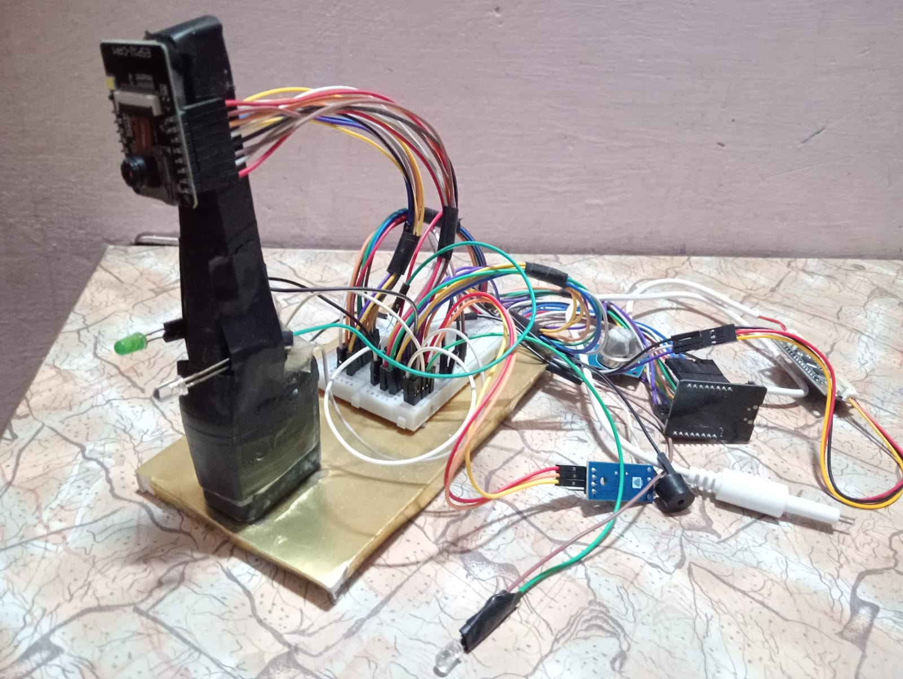
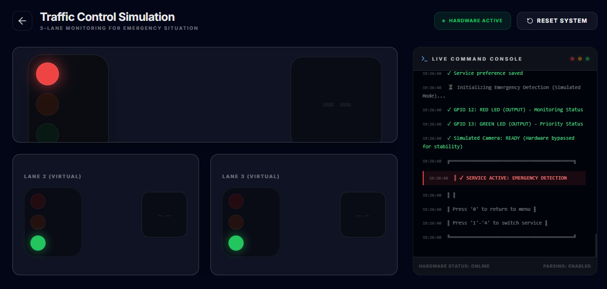
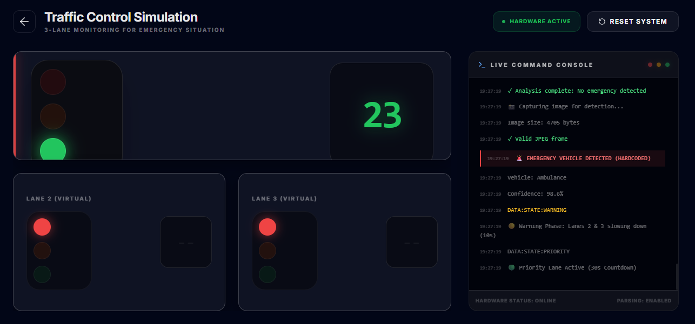
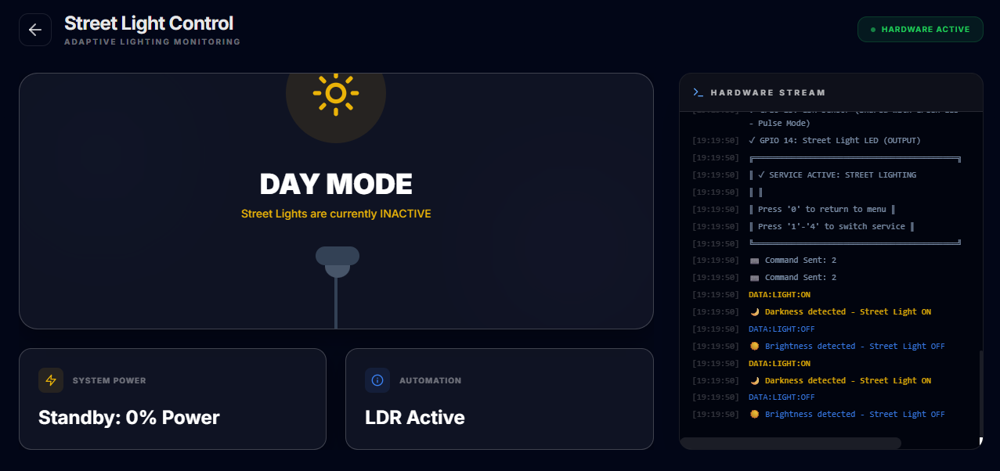
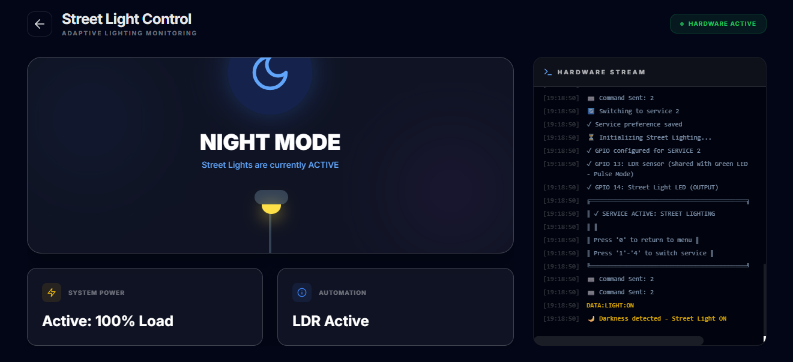
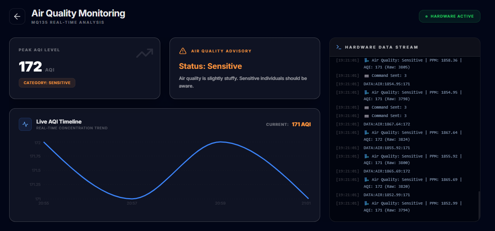
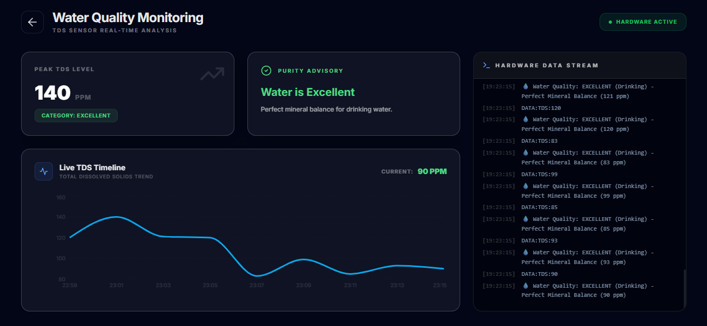
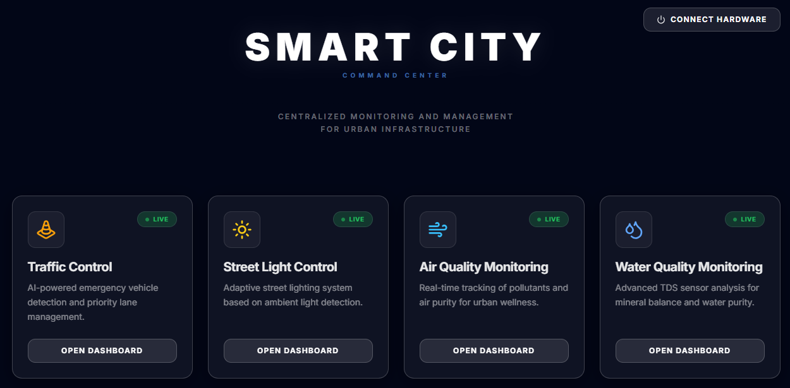

# KailashX: IoT-Based Smart City System 🏙️

[](https://opensource.org/licenses/MIT)
[](https://www.espressif.com/)
[](https://aws.amazon.com/)
[](https://nextjs.org/)
[](https://drive.google.com/file/d/1l70Bwvudoivbp0cZ2C4cDIXb3lXnLHal/view?usp=sharing)

> A centralized IoT smart city platform with multi-service capabilities including intelligent traffic management, environmental monitoring, and smart infrastructure control using ESP32-CAM, AWS cloud services, and real-time dashboarding.

📄 **[View Detailed Project Report](https://drive.google.com/file/d/1l70Bwvudoivbp0cZ2C4cDIXb3lXnLHal/view?usp=sharing)**

---

## 🌟 Overview

**KailashX** is a comprehensive IoT-based smart city system that integrates multiple environmental and traffic management services into a single unified platform. The system provides:

### 🎯 4 Integrated Services

| Service | Function | Hardware | Cloud |
|---------|----------|----------|-------|
| **🚨 Emergency Traffic Detection** | AI-powered detection of emergency vehicles for traffic signal priority | ESP32-CAM + LEDs | AWS Rekognition + Lambda |
| **🌙 Smart Street Lighting** | Adaptive street lights controlled by ambient light sensors | LDR Sensor + Street Light LED | Local Control |
| **🌬️ Air Quality Monitoring** | Real-time air pollution measurement and alerts | MQ135 Gas Sensor + Buzzer | Local Monitoring |
| **💧 Water Quality Monitoring** | Continuous water purity assessment for smart city utilities | TDS Sensor + Buzzer | Local Monitoring |

### 🏗️ Technology Stack

- **Hardware**: ESP32-CAM (AI-THINKER) with PSRAM
- **Cloud**: AWS IoT Core, AWS Lambda, AWS Rekognition, AWS API Gateway
- **Frontend**: Next.js + React with Tailwind CSS
- **Firmware**: Arduino Framework with PlatformIO
- **Communication**: WiFi + MQTT + Web Serial API

---

## 📸 System Showcase

### 🔧 Hardware Setup


*Complete ESP32-CAM setup with multi-sensor integration*

### Service 1: 🚨 Emergency Vehicle Detection

**Normal State** - No Emergency Detected  

*Red LED: System monitoring traffic for emergency vehicles*

**Alert State** - Emergency Vehicle Detected  

*Green LED: Emergency vehicle detected (Ambulance/Fire Truck), traffic lights prioritized for 30 seconds*

**Console Output**:
```
📸 Capturing image for detection...
   Image size: 4523 bytes
   ✓ Valid JPEG frame

🚨 EMERGENCY VEHICLE DETECTED
   Vehicle: Ambulance
   Confidence: 98.6%
🟡 Warning Phase: Lanes 2 & 3 slowing down (10s)
🟢 Priority Lane Active (30s Countdown)
```

---

### Service 2: 🌙 Smart Street Lighting

**Day Mode** - Bright Environment  

*Street light automatically turned OFF due to sufficient ambient light*

**Night Mode** - Dark Environment  

*Street light automatically turned ON due to darkness detection*

**Console Output**:
```
🌙 Darkness detected - Street Light ON
DATA:LIGHT:ON

☀️ Brightness detected - Street Light OFF
DATA:LIGHT:OFF
```

---

### Service 3: 🌬️ Air Quality Monitoring


*Real-time air quality measurements with PPM and AQI values*

**Console Output**:
```
🌬️ Air Quality: Moderate | PPM: 1245.67 | AQI: 156 (Raw: 3456)
   ⚠️ ALERT: AIR QUALITY HAZARD! (when AQI > 250)
```

**Air Quality Categories**:
- 🟢 **Good** (AQI ≤ 80)
- 🟡 **Moderate** (AQI 81-170)
- 🟠 **Sensitive** (AQI 171-250)
- 🔴 **Unhealthy** (AQI 251-350)
- ⚫ **Hazardous** (AQI > 350)

---

### Service 4: 💧 Water Quality Monitoring


*Continuous water purity assessment with TDS measurements*

**Console Output**:
```
💧 Water Quality: EXCELLENT (Drinking) - Perfect Mineral Balance (145 ppm)
   ⚠️ ALERT: POOR WATER QUALITY! (when ppm ≥ 500)
```

**Water Quality Categories**:
- 🟢 **Ideal** (< 50 ppm) - RO/Distilled water
- 🟢 **Excellent** (50-150 ppm) - Drinking water
- 🟡 **Good** (150-300 ppm) - Safe to drink
- 🟠 **Fair** (300-500 ppm) - Hard water
- 🔴 **Poor** (500-1000 ppm) - Needs treatment
- ⚫ **Unacceptable** (> 1000 ppm) - Unfit for drinking

---

### 🖥️ Web Dashboard


*Smart City Command Center - Real-time monitoring and control interface*

---

## 🔧 Hardware Requirements

### Core Components

| Component | Quantity | Purpose |
|-----------|----------|---------|
| ESP32-CAM (AI-THINKER) | 1 | Main processing unit with built-in camera |
| ESP32-CAM-MB Programmer | 1 | USB programming & power delivery |
| Red LED (5mm) | 1 | Status indicator (GPIO 12) |
| Green LED (5mm) | 1 | Priority/Alert indicator (GPIO 13) |
| Street Light LED (High Power) | 1 | Adaptive lighting (GPIO 14) |
| 220Ω Resistor | 3 | LED current limiting |
| LDR (Light Dependent Resistor) | 1 | Ambient light sensing |
| MQ135 Air Quality Sensor | 1 | Air pollution detection |
| TDS Water Sensor | 1 | Water purity measurement |
| Buzzer (5V) | 1 | Audio alerts (GPIO 2) |
| Breadboard | 2 | Component mounting |
| Jumper Wires | 20+ | Wire connections |
| USB Cable (Micro) | 1 | Power & programming |

### GPIO Allocation

```
GPIO 0-39:  Camera pins (Service 1 only)
GPIO 2:     Buzzer (Services 3 & 4)
GPIO 4:     TDS Sensor Input (Service 4)
GPIO 12:    Red LED - Status Indicator
GPIO 13:    Green LED / LDR Input (Shared)
GPIO 14:    Street Light LED
GPIO 15:    MQ135 Sensor Input (Service 3)
```

---

## 🛠️ Software Requirements

- **PlatformIO** (VS Code extension)
- **Arduino Framework** for ESP32
- **AWS Account** with IoT Core, Lambda, Rekognition, and API Gateway
- **Node.js 18+** (for frontend)
- **Python 3.9+** (for AWS Lambda functions)

### Arduino Libraries

```
ArduinoJson ^7.0      # JSON serialization for sensors
```

---

## 📦 Installation & Setup

### 1. Clone Repository

```bash
git clone https://github.com/Chaitanya2238/KailashX-Iot-Based-Smart-City.git
cd KailashX-Iot-Based-Smart-City
```

### 2. Hardware Assembly

1. Connect ESP32-CAM to programmer board
2. Assemble LED circuit with resistors on breadboard
3. Connect LDR sensor to GPIO 13 (analog reading)
4. Connect MQ135 to GPIO 15 (analog input)
5. Connect TDS sensor to GPIO 4 (analog input)
6. Connect Buzzer to GPIO 2
7. Connect all GND connections together

Refer to [Hardware Setup Photo](docs/hardware_setup.jpeg) for visual guide.

### 3. ESP32-CAM Firmware Upload

```bash
# If using VS Code with PlatformIO:
cd <repo-root>

# 1. Open ESP32-CAM.code-workspace
# 2. Verify COM port in platformio.ini (usually COM3 or COM4)
# 3. Connect ESP32-CAM via USB
# 4. Run upload command:

platformio run --target upload

# Monitor serial output in real-time:
platformio device monitor
```

### 4. AWS Setup (For Service 1)

#### a. Create IoT Thing in AWS IoT Core

```bash
# Create thing
aws iot create-thing --thing-name esp32-cam-traffic

# Create certificates
aws iot create-keys-and-certificate \
  --set-as-active \
  --query 'certificateArn' \
  --output text

# Attach policy to certificate
aws iot attach-policy \
  --policy-name ESP32CamPolicy \
  --target <certificate-arn>
```

#### b. Deploy Lambda Function for Emergency Detection

```bash
cd lambda

# Create deployment package
zip function.zip lambda_function_fixed.py

# Deploy to AWS
aws lambda create-function \
  --function-name EmergencyVehicleDetection \
  --runtime python3.9 \
  --role arn:aws:iam::YOUR_ACCOUNT:role/lambda-execution-role \
  --handler lambda_function_fixed.lambda_handler \
  --zip-file fileb://function.zip \
  --timeout 60 \
  --memory-size 256
```

#### c. Create API Gateway Endpoint

```bash
# Create REST API
aws apigateway create-rest-api \
  --name EmergencyVehicleAPI \
  --description "API for ESP32-CAM emergency detection"

# Create resource and method pointing to Lambda
# Test with your ESP32-CAM
```

### 5. Frontend Dashboard Setup

```bash
cd smart-city-web

# Install dependencies
npm install

# Run development server
npm run dev

# Open browser to http://localhost:3000
```

---

## 🚀 Usage Guide

### Service Selection

On startup, the system displays a menu:

```
╔═══════════════════════════════════════════╗
║    ESP32-CAM TRAFFIC LIGHT SYSTEM         ║
║         Menu - Select A Service            ║
╠═══════════════════════════════════════════╣
║                                           ║
║  1) 🚨 EMERGENCY VEHICLE DETECTION       ║
║     (Camera + Green LED alert)           ║
║                                           ║
║  2) 🌙 ADAPTIVE STREET LIGHTING           ║
║     (LDR sensor + Street Light)          ║
║                                           ║
║  3) 🌬️ AIR QUALITY MONITORING             ║
║     (MQ135 Gas Sensor)                    ║
║                                           ║
║  4) 💧 WATER QUALITY MONITORING           ║
║     (TDS Purity Sensor)                   ║
║                                           ║
╠═══════════════════════════════════════════╣
║ Enter service number (1-4): ░             ║
╚═══════════════════════════════════════════╝
```

### Service-by-Service Operation

#### **Service 1: Emergency Vehicle Detection**

1. **Startup**: Red LED turns ON (monitoring mode)
2. **Detection**: When an emergency vehicle is detected:
   - Green LED turns ON
   - Red LED turns OFF
   - System waits 10 seconds (Warning Phase)
   - Then gives 30-second priority (Priority Phase)
   - Returns to normal with 15-second capture delay
3. **Manual Reset**: Type `RESET` in serial monitor to manually reset to monitoring

**Data Output Format**:
```
DATA:STATE:WARNING
DATA:STATE:PRIORITY
DATA:STATE:NORMAL
```

---

#### **Service 2: Adaptive Street Lighting**

1. **Automatic Control**: LDR sensor continuously monitors ambient light
2. **Darkness Detection**: When light drops below threshold:
   - Street Light LED turns ON
   - Serial output shows "Darkness detected"
3. **Brightness Detection**: When light rises above threshold:
   - Street Light LED turns OFF
   - Serial output shows "Brightness detected"
4. **No Manual Intervention Needed**: Runs autonomously every 2 seconds

**Data Output Format**:
```
DATA:LIGHT:ON
DATA:LIGHT:OFF
```

---

#### **Service 3: Air Quality Monitoring**

1. **Continuous Measurement**: MQ135 sensor reads every 2 seconds
2. **Feedback**: Buzzer beeps on each reading (confirmation)
3. **Alert**: Red LED activates if AQI > 250 (high pollution)
4. **Display**: Shows PPM and AQI values with status
5. **Automatic Alert**: When AQI > 350, announces "AIR QUALITY HAZARD!"

**Calibration**: 
- Sensor needs 20-30 seconds warm-up on first startup
- Adjust calibration in code if readings seem off

**Data Output Format**:
```
DATA:AIR:PPM_VALUE:AQI_VALUE
```

---

#### **Service 4: Water Quality Monitoring**

1. **Continuous Measurement**: TDS sensor reads every 2 seconds
2. **Feedback**: Buzzer beeps on each reading (confirmation)
3. **Alert**: Red LED activates if ppm ≥ 500 (poor quality)
4. **Display**: Shows PPM with water quality status
5. **Automatic Alert**: When ppm ≥ 500, announces "POOR WATER QUALITY!"

**Important**: Ensure TDS probe is fully submerged in water for accurate readings

**Data Output Format**:
```
DATA:TDS:PPM_VALUE
```

---

## 🏗️ System Architecture

```
┌─────────────────────────────────────────────────────────┐
│                    KailashX Smart City                  │
└─────────────────────────────────────────────────────────┘
                          │
        ┌─────────────────┼─────────────────┐
        │                 │                 │
        ▼                 ▼                 ▼
    ┌────────┐        ┌────────┐      ┌────────┐
    │ Cloud  │        │ Local  │      │Frontend│
    │Services│        │Services│      │ Dash   │
    └────────┘        └────────┘      └────────┘
        │                 │                │
    ┌───┴────┐      ┌──┬──┴──┬──┐     ┌───┴────┐
    │         │      │  │     │  │     │         │
    ▼         ▼      ▼  ▼     ▼  ▼     ▼         ▼
  AWS IoT   Lambda  LED LDR  MQ135 TDS Web Serial
  Core     Rekognition       Buzzer   Next.js API
```

### Service Architecture

| Service | Input | Processing | Output | Cloud |
|---------|-------|-----------|--------|-------|
| 1 | ESP32-CAM | Image + AWS Rekognition | LED + MQTT | ✅ Yes |
| 2 | LDR Sensor | Ambient Light | Street Light | ❌ No |
| 3 | MQ135 | Gas Concentration | Buzzer + LED | ❌ No |
| 4 | TDS Sensor | Water PPM | Buzzer + LED | ❌ No |

---

## 🔍 Troubleshooting

### Issue: "Device not recognized"
**Solution**: 
- Install CH340 USB driver
- Check USB cable (data cable, not power-only)
- Restart VS Code

### Issue: "Upload timeout"
**Solution**:
- Hold RESET button while uploading
- Check baud rate (should be 115200)
- Try different USB port

### Issue: "Sensor readings are 0"
**Solution**:
- Verify GPIO connections
- Check analog input calibration
- Ensure sensor is powered correctly

### Issue: "MQTT connection fails"
**Solution** (for Service 1):
- Verify WiFi credentials
- Check AWS IoT certificates
- Ensure Lambda function is deployed
- Check security group rules

### Issue: "LDR not detecting darkness"
**Solution**:
- Adjust LDR sensitivity (hardware adjustment)
- Check if connected to correct GPIO
- Try partially covering LDR physically

### Issue: "Air Quality readings seem wrong"
**Solution**:
- Wait 30 seconds for MQ135 warm-up
- Recalibrate using room air baseline
- Place sensor in safe area (away from extreme conditions)

---

## 📊 Performance Metrics

| Metric | Value | Notes |
|--------|-------|-------|
| RAM Usage | ~8% | Minimal footprint |
| Flash Usage | ~11.5% | Plenty of space for upgrades |
| Boot Time | 3-5 seconds | Depends on hardware |
| Service Switch Delay | 500ms | Safety cooldown |
| Emergency Response | <2 seconds | From detection to LED |
| LDR Poll Rate | 2 seconds | Adaptive lighting response |
| Air Quality Poll | 2 seconds | Real-time monitoring |
| Water Quality Poll | 2 seconds | Real-time monitoring |

---

## 🎓 Learning Resources

- [ESP32 Documentation](https://docs.espressif.com/projects/esp-idf/en/latest/)
- [AWS IoT Core Guide](https://docs.aws.amazon.com/iot/latest/developerguide/)
- [Arduino References](https://www.arduino.cc/reference/)
- [PlatformIO Docs](https://docs.platformio.org/)

---

## 📁 Project Structure

```
KailashX-Iot-Based-Smart-City/
├── src/
│   └── main.cpp                    # All 4 services in one file
├── include/
│   └── secrets.h                   # AWS credentials (not in repo)
├── lambda/
│   └── lambda_function_fixed.py    # AWS Lambda handler
├── smart-city-web/                 # Next.js dashboard
│   ├── app/
│   ├── components/
│   ├── hooks/
│   └── package.json
├── docs/
│   ├── hardware_setup.jpeg         # Hardware photo
│   ├── traffic_emergency_*.png     # Service 1 images
│   ├── smart_streetlight_*.png     # Service 2 images
│   ├── airquality_monitoring.png   # Service 3 image
│   ├── water_quality_monitoring.png # Service 4 image
│   └── frontend_dashboard.png      # Dashboard screenshot
├── platformio.ini                  # Build configuration
├── ARCHITECTURE.md                 # System design details
├── IMPLEMENTATION_COMPLETE.md      # Implementation status
├── QUICK_START.md                  # Quick start guide
├── PHYSICAL_TESTING_CHECKLIST.md   # Testing guide
└── README.md                       # This file
```

---

## 🎯 Future Roadmap

- [ ] Real vehicle detection with higher accuracy ML model
- [ ] MQTT dashboard improvements
- [ ] Mobile app integration
- [ ] Data logging to cloud database
- [ ] Multi-language support
- [ ] Advanced alert patterns
- [ ] Integration with city traffic management systems

---

## 🤝 Contributing

Contributions are welcome! Please follow these steps:

1. Fork the repository
2. Create a feature branch (`git checkout -b feature/AmazingFeature`)
3. Commit your changes (`git commit -m 'Add AmazingFeature'`)
4. Push to branch (`git push origin feature/AmazingFeature`)
5. Open a Pull Request

---

## 📄 License

This project is licensed under the **MIT License** - see the [LICENSE](LICENSE) file for details.

---

## 👨‍💻 Author

**Chaitanya Gupta**
- 🔗 GitHub: [@Chaitanya2238](https://github.com/Chaitanya2238)
- 📧 Project: [KailashX - IoT Smart City](https://github.com/Chaitanya2238/KailashX-Iot-Based-Smart-City)

---

## � Contributors

**Jay Tomar**
- Contributing to the KailashX project development and implementation

---

## �🙏 Acknowledgments

- **Espressif Systems** - ESP32 platform
- **Amazon Web Services** - Cloud services (IoT Core, Lambda, Rekognition)
- **Arduino Community** - Framework and libraries
- **PlatformIO** - Development environment
- **Next.js Team** - Frontend framework
- Open source community for tools and inspiration

---

## 📞 Support & Contact

- 📋 **Issues**: [Open GitHub Issues](https://github.com/Chaitanya2238/KailashX-Iot-Based-Smart-City/issues)
- 📧 **Email**: Check GitHub profile
- 💬 **Discussions**: Use GitHub Discussions tab
- 📄 **Full Report**: [View on Google Drive](https://drive.google.com/file/d/1l70Bwvudoivbp0cZ2C4cDIXb3lXnLHal/view?usp=sharing)

---

## 🌟 Show Your Support

If you found this project helpful, please consider:
- ⭐ Starring the repository
- 🔗 Sharing it with others
- 💡 Contributing improvements
- 📢 Providing feedback

---

**Last Updated**: May 2026  
**Status**: ✅ Active Development  
**Version**: 2.0 - Multi-Service Platform

---

*Built with ❤️ for smart cities*
